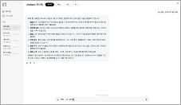
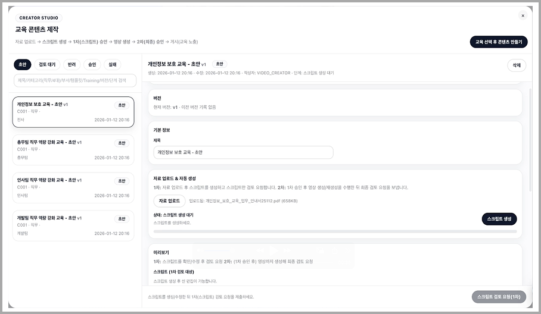
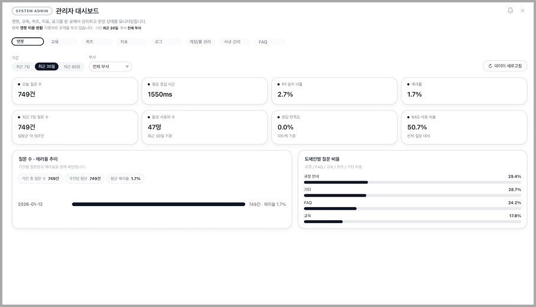
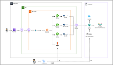

# CTRLF Backend

> **CTRL+F** — 기업 그룹웨어 **교육·챗봇 플랫폼**의 **멀티 모듈 Spring Boot** 백엔드

---

## 프로젝트 소개

**CTRLF**는 사내 **필수 교육**(4대 교육, 직무 교육, 퀴즈, 교육 영상 생성 및 관리), **AI 챗봇**(RAG·LLM 기반 FAQ/사규 질의응답), **관리자 대시보드**를 하나의 플랫폼으로 제공하는 서비스입니다.  
이 레포지토리(**ctrlf-back**)는 그 **백엔드 API**를 담당하는 **MSA(Microservice Architecture)** 구성의 멀티 모듈 Spring Boot 프로젝트입니다.

- **프론트엔드**: [ctrlf-front](https://github.com/yunyami0605/ctrlf-front) (React + TypeScript + Vite)
- **AI 서버**: [terraform](https://github.com/yunyami0605/ctrlf-ai) (FastAPI, Ragflow)

---

## 스크린샷

### AI 챗봇



### 교육 영상 컨텐츠 제작



### 관리자 대시보드



---

## 주요 기능

| 영역                 | 설명                                                                                        |
| -------------------- | ------------------------------------------------------------------------------------------- |
| **챗봇 (Chat)**      | LLM 대화 세션/메시지, FAQ, 스트리밍 응답, 피드백 수집, Elasticsearch 로그                   |
| **교육 (Education)** | AI 교육 영상, 스크립트 제작, 필수 교육(4대/직무), 퀴즈, 검토자 데스크, 제작자 스튜디오 연동 |
| **인프라 (Infra)**   | 사용자 관리(Keycloak 연동), S3 파일 업로드, RAG 문서/청크, 대시보드 로그, 메트릭            |
| **API Gateway**      | 경로 기반 라우팅, JWT 검증, Actuator·Prometheus 메트릭                                      |

---

## 기술 스택

| 구분                | 기술                                                                                                                  |
| ------------------- | --------------------------------------------------------------------------------------------------------------------- |
| **언어·프레임워크** | Java 17, **Spring Boot 3.3**, Spring Cloud (Gateway, OpenFeign)                                                       |
| **DB·마이그레이션** | **PostgreSQL**, **Flyway** (서비스별 스키마: `chat`, `education`, `infra`)                                            |
| **인증·인가**       | **Keycloak** (OAuth2/OIDC), JWT, 역할 기반 접근 제어                                                                  |
| **인프라·운영**     | **Docker** / **Docker Compose**, **Kubernetes (EKS, 백엔드 서버)**, **On-premiss(ai 서버, LLM 서버)**                 |
| **기타**            | **Elasticsearch** (채팅/FAQ 로그), **AWS S3** (파일 저장), **SpringDoc OpenAPI** (Swagger), **Micrometer/Prometheus** |

---

## 시스템 아키텍처



- **구조**: MSA. 트래픽은 **IGW → ALB → EKS Ingress**로 유입되고, 경로 기반 라우팅으로 각 서비스로 분기됩니다.
- **서비스 구성**:
  - **api-gateway** (8080): 진입점, JWT 검증, 메트릭
  - **chat-service** (9005): 챗봇, FAQ, Elasticsearch
  - **education-service** (9002): 교육, 영상, 퀴즈, 스크립트
  - **infra-service** (9003): 사용자, S3, RAG, 대시보드 로그·메트릭
- **공통 인프라**: PostgreSQL(5432), Keycloak(8090).

```
User → ALB → EKS Ingress → api-gateway
                                        ├→ chat-service
                                        ├→ education-service
                                        └→ infra-service
                                                    ↓
                                            On‑prem LLM / RAG (VPN)
```

---

## 프로젝트 구조

```
ctrlf-back/
├── api-gateway/          # Spring Cloud Gateway, JWT 검증
├── chat-service/         # 챗봇, FAQ, Elasticsearch
├── education-service/    # 교육, 영상, 퀴즈, 스크립트
├── infra-service/        # 사용자, S3, RAG, 대시보드
├── libs/
│   ├── common-dto/       # 공통 DTO, API 응답 래퍼
│   ├── common-security/  # Security 설정, 유틸
│   ├── common-utils/     # OpenAPI, 예외, AI RestClient
│   └── common-constants/ # 역할 등 상수
├── keycloak-realms/      # Keycloak realm import
├── keycloak-themes/      # 커스텀 로그인 테마
├── postgres-init/        # DB 초기화 스크립트
├── scripts/              # Keycloak Service Account 설정 등
├── kubernetes/           # K8s manifests (EKS 배포)
├── docker-compose.yml    # 로컬 Postgres, Keycloak
└── docs/                 # API 스펙, 아키텍처, 가이드
```

---

## 빠른 시작

### 사전 요구사항

- **Java 17**, **Docker / Docker Compose v2**, **Gradle** (Wrapper 포함)
- AWS CLI (S3 등 AWS 연동 시)

### 1. 인프라 기동 (Postgres, Keycloak)

```bash
docker compose up -d
docker compose ps
```

- Postgres: `localhost:5432`, 사용자/DB = `postgres` / `db`
- Keycloak: `http://localhost:8090`, 관리자 `admin` / `admin`  
  `keycloak-realms/` 의 realm이 `--import-realm` 으로 자동 import 됩니다.

### 2. 서비스 실행

```bash
# Keycloak 설정·시드 없이 실행 (예: chat)
AWS_PROFILE=your_profile ./gradlew :chat-service:bootRun

# 교육 서비스 (시드·Keycloak 설정 필요 시)
AWS_PROFILE=your_profile SPRING_PROFILES_ACTIVE=dev,local-seed,keycloak-setup \
  ./gradlew :infra-service:bootRun   # 먼저 기동
AWS_PROFILE=your_profile SPRING_PROFILES_ACTIVE=dev,local-seed,keycloak-setup \
  ./gradlew :education-service:bootRun
```

- DB 연결·Flyway: 각 서비스 `application.yml` 및 `db/` 마이그레이션 참고.
- `local-seed` 는 기존 데이터 삭제 후 시드 생성. 운영은 `prod`, `prod-seed` 프로파일 사용.

### 3. API 문서 (Swagger)

| 서비스    | Swagger UI                            |
| --------- | ------------------------------------- |
| Chat      | http://localhost:9005/swagger-ui.html |
| Education | http://localhost:9002/swagger-ui.html |
| Infra     | http://localhost:9003/swagger-ui.html |

---

## 배포 및 CI/CD

- **GitHub Actions**: 서비스별 워크플로우 (`chat`, `education`, `infra`, `keycloak`) — 빌드·테스트·이미지 푸시.
- **배포**: ECR 이미지 → **EKS** (Kubernetes). Terraform으로 VPC, EKS, RDS, S3, ALB 등 인프라 관리.
- K8s 매니페스트: `kubernetes/` 디렉토리 참고.

---

## 코드 컨벤션 및 브랜치 전략

- **컨벤션**: Java 17, 4칸 들여쓰기, 패키지 소문자, 클래스 PascalCase, 메서드/변수 camelCase. `@Slf4j`, 생성자 주입, Bean Validation 사용.
- **브랜치**: `main` 보호, 기능/픽스는 토픽 브랜치 (`feature/*`, `fix/*` 등) → PR 후 병합. 릴리스 태그 `vMAJOR.MINOR.PATCH`.
- **커밋**: Conventional Commits (`feat(scope):`, `fix(scope):` 등).

---

## 라이선스

Private — CTRL+F Team.

---

_이 README는 **포트폴리오** 용도로 재구성되었습니다. 운영·개발 상세(Keycloak 스크립트, DB 스키마 명령, 컨벤션 전문 등)는 `docs/` 및 리포지토리 내부 문서를 참고해 주세요._
