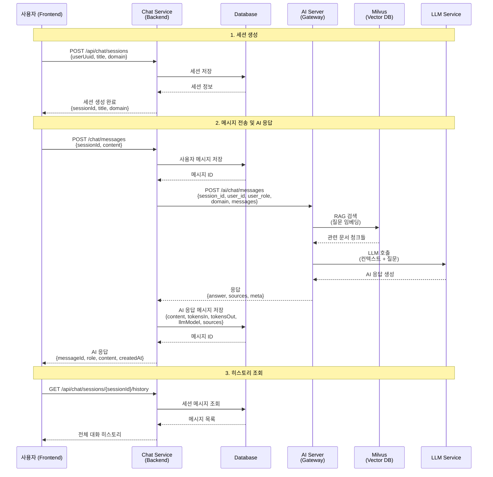
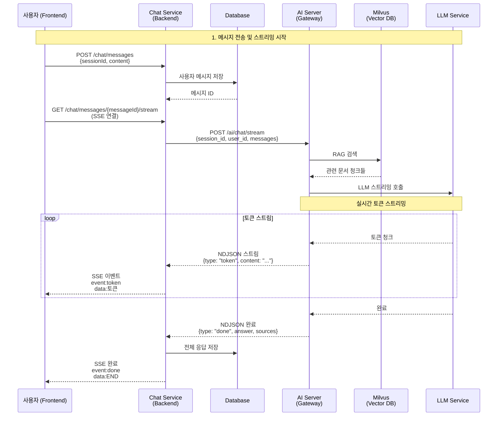
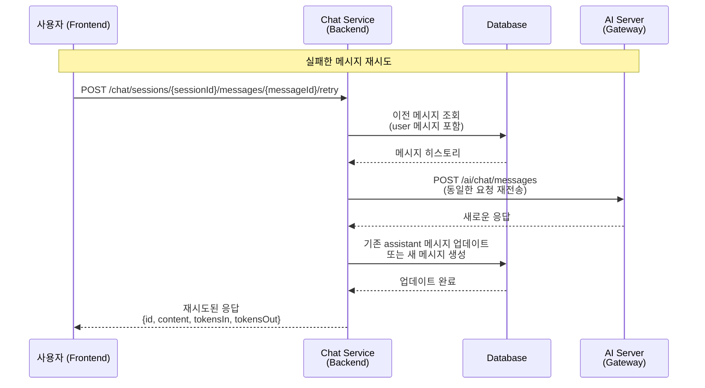
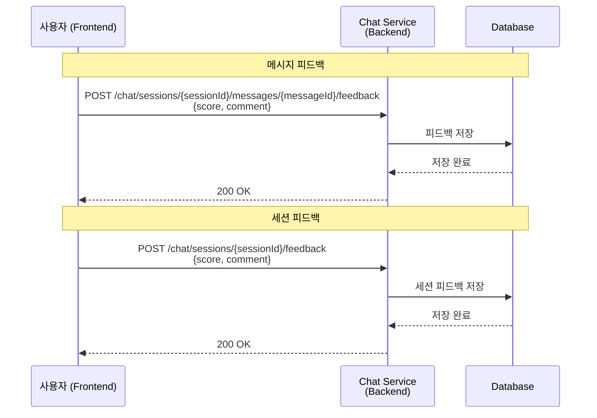
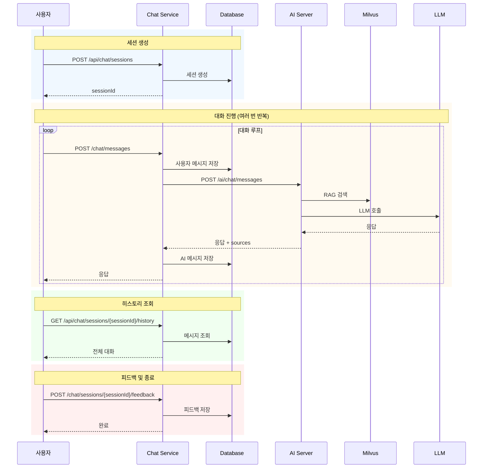
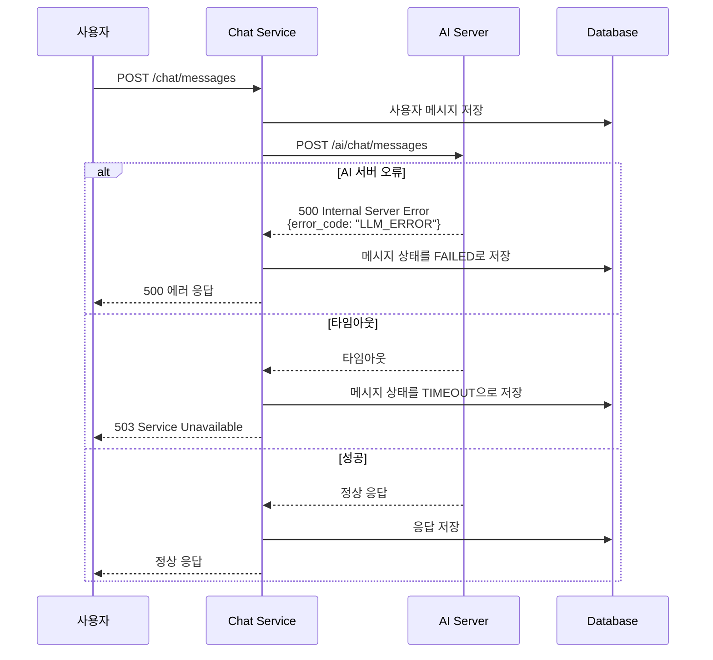

# 채팅 서비스 플로우 시퀀스 다이어그램

> **Notion 사용법**: 아래 Mermaid 코드를 Notion의 Code Block에서 `mermaid` 언어로 선택하여 붙여넣으면 시퀀스 다이어그램이 렌더링됩니다.

---

## 1. 일반 채팅 메시지 플로우

---

## 2. 스트리밍 채팅 메시지 플로우 (SSE)

---

## 3. 메시지 재시도 플로우

---

## 4. 피드백 제출 플로우

---

## 5. 전체 채팅 생명주기 플로우

---

## 6. 에러 처리 플로우

---

## 주요 엔드포인트 매핑

### Chat Service (Backend)

- `POST /api/chat/sessions` - 세션 생성
- `GET /api/chat/sessions/{sessionId}` - 세션 조회
- `GET /api/chat/sessions/{sessionId}/history` - 히스토리 조회
- `POST /chat/messages` - 메시지 전송
- `GET /chat/messages/{messageId}/stream` - SSE 스트리밍
- `POST /chat/sessions/{sessionId}/messages/{messageId}/retry` - 재시도
- `POST /chat/sessions/{sessionId}/messages/{messageId}/feedback` - 메시지 피드백
- `POST /chat/sessions/{sessionId}/feedback` - 세션 피드백

### AI Server (Gateway)

- `POST /ai/chat/messages` - 일반 채팅 응답
- `POST /ai/chat/stream` - 스트리밍 채팅 응답 (NDJSON)

**참고**: `/ai/search` 엔드포인트는 더 이상 사용되지 않습니다. (삭제됨)

---

## 데이터 흐름

1. **사용자 메시지**: Frontend → Chat Service → Database
2. **AI 요청**: Chat Service → AI Server
3. **RAG 검색**: AI Server → Milvus (Vector DB)
4. **LLM 호출**: AI Server → LLM Service
5. **AI 응답**: AI Server → Chat Service → Database → Frontend

---

**문서 버전**: 2025-12-19  
**작성자**: AI Assistant
